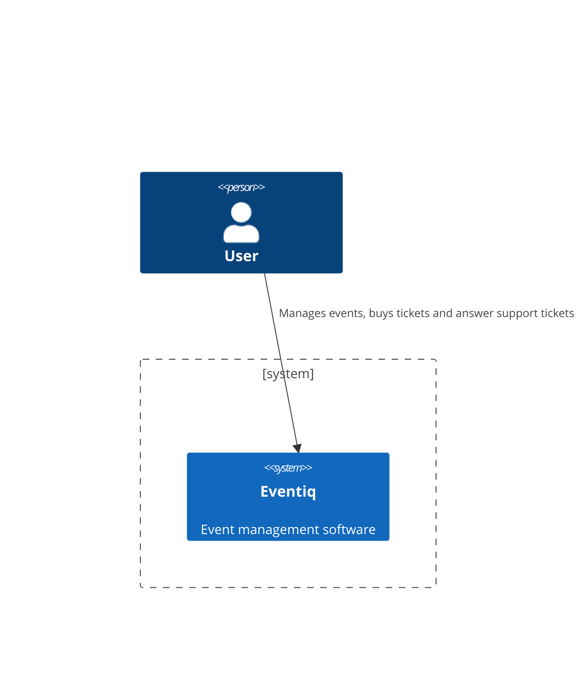
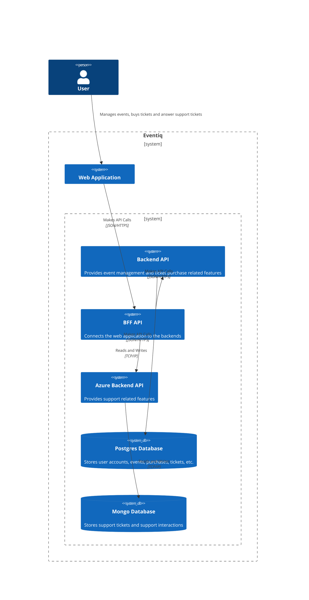
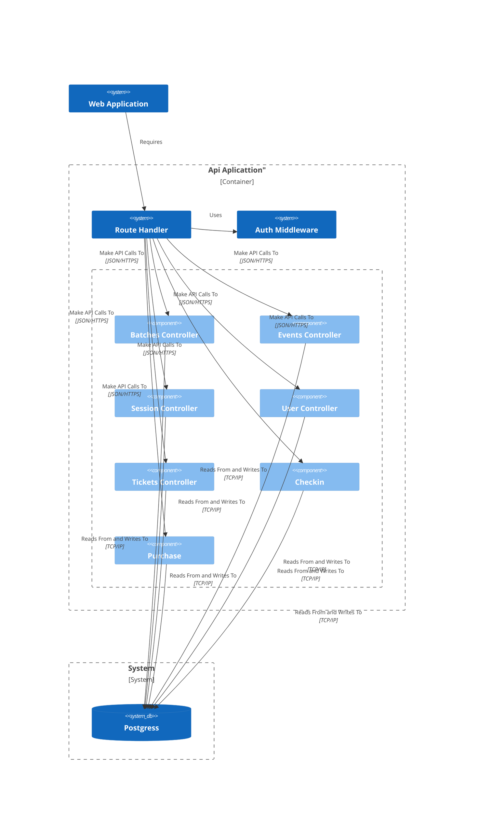
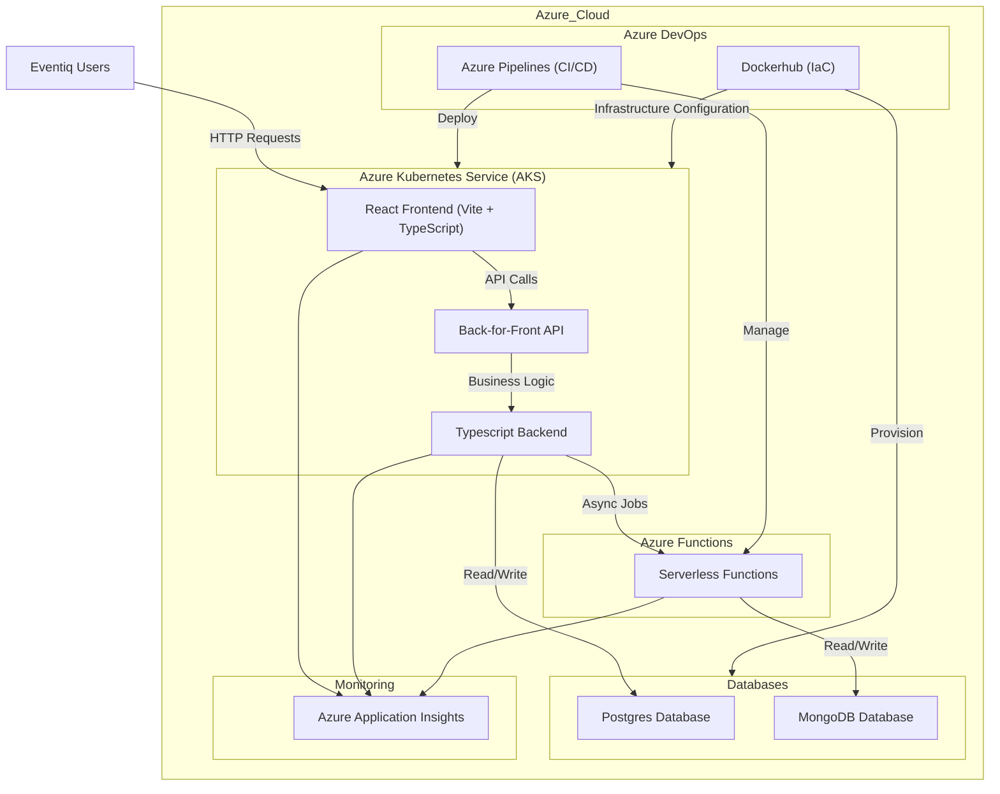
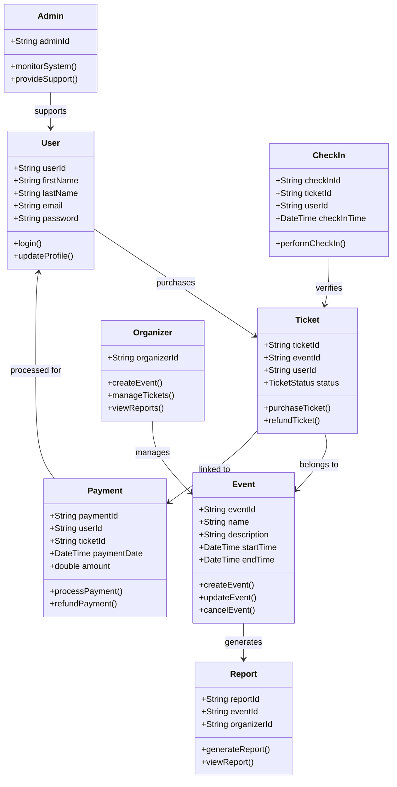

# Eventiq - System Architecture (arc42 Template)

## 1. Introduction and Goals

This document provides an architectural overview of Eventiq's system using the arc42 template. It focuses on the key components, their relationships, and the constraints guiding the design and implementation of the system. The primary goal of this architecture is to facilitate a scalable, maintainable, and efficient event ticket management platform that allows organizers to create, edit and delete events, manage tickets and view reports from past events, meanwhile, users are able to buy tickets for events they are interested in.

### Requirements Overview

The Eventiq system allows administrators, organizers, and users to register, log in, and manage events. Organizers can create, edit, and cancel events, define ticket batches, perform digital check-ins, and generate reports. Users can browse events, purchase tickets, view their history, and edit personal information. The system also supports social media logins and ensures role-based access control for different user types.

### Quality Goals

| Quality Goal    | Scenario                                                                                                | Priority |
| --------------- | ------------------------------------------------------------------------------------------------------- | -------- |
| Maintainability | The system's codebase should be modular and well-documented to facilitate easy updates and bug fixes.     | High     |
| Security        | Sensitive data, such as user information and payment details, must be encrypted in transit and at rest.  | High     |
| Performance     | The system must respond to requests with minimal delay to ensure a smooth user experience                | High     |

### Stakeholders

| Role/Name          | Responsibility                                                                             |
| ------------------ | ------------------------------------------------------------------------------------------ |
| Event Organizer    | Create and manage events, configure ticket sales, and access post-event reports.           |
| Customer           | Purchase tickets and perform check-ins at events.                                          |
| Administrator      | Provide technical support, ensure system functionality, and perform necessary maintenance. |
| Development Team   | Implement and maintain the source code in an efficient and secure manner.                  |
| Software Architect | Ensure that the architecture meets scalability, security, and performance requirements.    |

---

## 2. Architecture Constraints

- The system must comply with the LGPD (General Data Protection Law).
- As the system is free to use, it relies on ticket sales for revenue. This limits extensive resource allocation for non-critical features.

### Technology Stack

The Eventiq system will be developed using the following technology stack deployed on a public cloud (Azure) with Platform as a Service (PaaS):

- **Frontend**: React Vite+Typescript web application.
- **Back-for-Front API**: Intermediary API layer to handle communication between the frontend and backend services.
- **Backend Services**:
  - Typescript Backend: Handles core business logic, interfacing with an SQL database.
  - Azure Functions Backend: Handles specific serverless operations, interfacing with a MongoDB database.
- **Databases**:
  - Postgres: Primary relational database for structured data.
  - MongoDB: NoSQL database for unstructured data.
- **Infrastructure & DevOps**:
  - Dockerhub: Infrastructure as Code (IaC) tool for configuring resources.
  - Azure Pipelines: Continuous integration and delivery (CI/CD) for automated builds and deployments.
  - Kubernetes: Orchestration for containerized applications.
  - Docker: Containerization platform.

### Deployment Constraints

- **Cloud Platform**: The system will be hosted on Azure and must utilize Azure services to ensure stability, security, and scalability.
- **Performance Requirements**: The system must handle high usage spikes effectively, maintaining good performance under load.
- **Timeline**: The project must be fully developed, tested, and deployed by November 23.

---

## 3. System Scope and Context

### 3.1 Business Context

The business context for Eventiq defines the interactions between the system and its stakeholders. These stakeholders include event organizers, customers, administrators, and the development team.

#### Business Context Diagram

  **Users:** 
- **Event Organizer**: Interacts with the system to create/manage events and view reports.
- **Customer**: Purchases tickets, checks in, and views event details.
- **Administrator**: Supports system health and functionality.

## 3.2 Technical Context {#_technical_context}

## 4. Solution Strategy

### 4.1 Technology Selection

Eventiq uses a technology stack built on modern web frameworks and cloud services to ensure scalability, flexibility, and performance. Key considerations:

- **Frontend**: React + Vite + TypeScript for a fast, modular UI.
- **Backend**: Typescript for performance and concurrency handling, Azure Functions for scalability and cost-effectiveness.
- **Databases**: Postgres for structured transactional data, MongoDB for flexible, unstructured data.
- **DevOps**: Dockerhub and Azure Pipelines for infrastructure and CI/CD, Kubernetes and Docker for container orchestration.

### 4.2 Architecture Approach

The architecture follows a microservices model, with clear separations between frontend, backend, and infrastructure services to ensure scalability and maintainability.

---

## 5. Building Blocks

### 5.1 C4Model level 3 Diagram

### 5.2 Key Components and Relations

The system relies on these key components:

- **Frontend** interacts with the BFF API for ticket sales, user interactions, and event listings.
- **BFF API** forwards requests to the **Typescript Backend** for critical business logic (event creation, ticketing) and the **Azure Functions Backend** for specific serverless tasks.
- The **Postgres** stores key structured data, such as user profiles and transaction histories.
- **MongoDB** manages flexible, unstructured data, such as logs or dynamically changing event configurations.

---

## 6. Runtime Scenarios

## 6. Runtime Scenarios

### 6.1 Ticket Purchase Flow (Happy Path)

1. A customer logs into the frontend and browses available events.
2. The frontend sends a request to the BFF API to retrieve event details.
3. The BFF API calls the Typescript Backend to fetch event information from the SQL database.
4. The user selects an event and purchases tickets.
5. The frontend sends the purchase request to the BFF API, which calls the Typescript Backend to process the transaction.
6. The Typescript Backend stores the transaction in the SQL database.
7. A confirmation message is returned to the user with the ticket details.

### 6.2 Event Creation Flow (Happy Path)

1. The event organizer logs into the system and selects "Create Event."
2. The frontend sends a request to the BFF API.
3. The BFF API calls the Typescript Backend to create a new event and store its details in the SQL database.
4. Upon successful creation, the event is made available in the event listing for customers.

### 6.3 Social Login Flow

1. A new user visits the Eventiq platform and clicks on the "Sign in with Google" button on the frontend.
2. The frontend sends a request to the BFF API to initiate the social login via Google OAuth.
3. The BFF API redirects the user to Google's OAuth server for authentication.
4. After successful authentication, Google returns an OAuth token to the BFF API.
5. The BFF API sends the token to the Typescript Backend, which verifies the token and retrieves user details.
6. The Typescript Backend stores the user’s information in the SQL database if they are logging in for the first time.
7. The user is successfully logged into the platform, and a JWT is issued for subsequent requests.

### 6.4 Event Cancellation Flow

1. An event organizer selects an event from their event management dashboard and clicks on "Cancel Event."
2. The frontend sends a cancellation request to the BFF API.
3. The BFF API forwards the cancellation request to the Typescript Backend.
4. The Typescript Backend updates the event's status in the SQL database to "Cancelled."
5. The Typescript Backend also triggers a notification to all ticket holders via email (handled by Azure Functions).
6. The frontend displays a confirmation message to the organizer that the event has been cancelled, and customers receive email notifications about the cancellation.

### 6.5 Report Generation Flow

1. An event organizer requests a sales report for an event that has ended.
2. The frontend sends a report generation request to the BFF API.
3. The BFF API forwards the request to the Typescript Backend.
4. The Typescript Backend queries the SQL database for ticket sales, attendance, and revenue information for the specified event.
5. The Typescript Backend sends the data to Azure Functions, which generates a detailed PDF report asynchronously.
6. Once the report is ready, Azure Functions stores it in Azure Blob Storage and sends a download link to the organizer via email.
7. The frontend also displays a notification that the report is being generated, with a link provided once the process is complete.

### 6.6 User Profile Update Flow

1. A logged-in user navigates to their profile page and makes changes (e.g., updating their email address or password).
2. The frontend sends a profile update request to the BFF API.
3. The BFF API forwards the request to the Typescript Backend.
4. The Typescript Backend validates the user input and updates the user's profile in the SQL database.
5. If the user updated sensitive information like their password, the Typescript Backend securely encrypts the new password before storing it.
6. The frontend confirms the successful profile update to the user.

### 6.7 Digital Check-In Flow

1. A customer arrives at an event and presents their digital ticket (QR code).
2. The event staff scans the QR code using a mobile app connected to the Eventiq system.
3. The mobile app sends the QR code data to the BFF API.
4. The BFF API forwards the request to the Typescript Backend, which verifies the ticket's validity by checking the SQL database.
5. If the ticket is valid, the Typescript Backend marks the customer as "checked in" and sends a confirmation to the mobile app.
6. The staff sees the confirmation, allowing the customer to enter the event.
7. The SQL database is updated in real-time to reflect the customer’s attendance.

### 6.8 Ticket Refund Flow

1. A customer requests a refund for a ticket to an event that has been cancelled or rescheduled.
2. The frontend sends a refund request to the BFF API.
3. The BFF API forwards the refund request to the Typescript Backend.
4. The Typescript Backend verifies the customer's eligibility for a refund (e.g., cancellation rules, refund policy).
5. The Typescript Backend processes the refund request via a third-party payment provider (e.g., Stripe).
6. Once the refund is processed, the SQL database is updated, and a confirmation email is sent to the customer, handled by Azure Functions.
7. The frontend displays a success message to the customer, confirming the refund.

### 6.9 High Load Event Flow (Performance Under Load)

1. An organizer creates a high-profile event with a large number of tickets available for sale.
2. At the time of ticket release, a significant number of users try to purchase tickets simultaneously.
3. The frontend sends ticket purchase requests to the BFF API.
4. The BFF API distributes the load between multiple instances of the Typescript Backend, managed by Kubernetes.
5. Each Typescript Backend instance processes the purchase requests in parallel, querying the SQL database for ticket availability and handling transactions.
6. Azure's auto-scaling mechanisms trigger additional compute resources to handle the traffic surge, maintaining system performance.
7. Tickets are allocated on a first-come, first-served basis, and users who successfully purchase tickets receive confirmation messages.
8. The system ensures consistency by locking database records related to ticket availability to avoid overselling.

## 7. Deployment View

### 7.1 Infrastructure Setup

Eventiq is hosted on Azure, using PaaS services for scalability and performance. Key components:

- **Azure Web App**: Hosts the React web application.
- **Azure Functions**: Executes serverless operations on demand.
- **Postgres**: Stores transactional and structured event data.
- **MongoDB (Atlas)**: Stores unstructured data, logs, and dynamically changing content.
- **Azure Kubernetes Service (AKS)**: Orchestrates containerized microservices, ensuring high availability and scalability.
- **Dockerhub**: Manages the infrastructure as code, ensuring consistent environments across deployments.

### 7.2 Deployment Diagram

## 8. Cross-Cutting Concepts

### 8.1 Domain Model

### 8.2 Security

- **Authentication**: Role-based access control is enforced via JWT tokens. Social login via OAuth (Google, Facebook) is supported.
- **Data Encryption**: Sensitive data such as user details and payment information are encrypted both in transit (TLS) and at rest (using database-level encryption).
- **Compliance**: The system adheres to LGPD, ensuring proper data handling practices and user consent management.

## 9. Architecture Decisions

### 9.1 Use of React with Vite and TypeScript for the Frontend
- **Decision**: Use React with Vite and TypeScript for building the frontend.
- **Rationale**: React provides a flexible, component-based framework that is widely supported and allows for rapid development. Vite offers fast bundling and an optimized development environment. TypeScript provides strong typing, helping to reduce runtime errors and enhance code maintainability.
- **Alternatives**: Angular, Vue.js
- **Status**: Accepted
- **Consequences**: The development team needs expertise in React and TypeScript. The chosen stack provides a scalable and modular frontend but requires attention to performance optimization as the project grows.

### 9.2 Azure PaaS for Cloud Infrastructure
- **Decision**: Host the application on Azure using Platform-as-a-Service (PaaS) solutions.
- **Rationale**: Azure provides a robust set of PaaS offerings such as Azure Functions, Azure Web Apps, and Azure Kubernetes Service (AKS), which are highly scalable, cost-effective, and reduce infrastructure management overhead. Azure’s security and compliance tools ensure that the system meets regulatory standards.
- **Alternatives**: AWS, Google Cloud Platform (GCP)
- **Status**: Accepted
- **Consequences**: By leveraging PaaS, the system benefits from scalability and ease of management, but the team must be proficient with Azure-specific technologies.

### 9.3 SQL Database for Transactional Data and MongoDB for Unstructured Data
- **Decision**: Use Postgres for transactional data and MongoDB for unstructured data.
- **Rationale**: Postgres is a proven relational database ideal for structured and transactional data (such as events, users, and purchases). MongoDB is better suited for flexible, unstructured data, such as logs and dynamic configurations.
- **Alternatives**: MySQL for SQL, Couchbase for NoSQL
- **Status**: Accepted
- **Consequences**: Developers must be familiar with both SQL and NoSQL paradigms. The two-database setup adds complexity to the architecture but provides the flexibility to handle different types of data efficiently.

## 10. Quality Requirements

### 10.1 Performance
- **Goal**: The system must handle high spikes in ticket sales and check-ins without performance degradation.
- **Measure**: The system should maintain sub-second response times under typical loads and handle peak traffic with acceptable response times.
- **Implementation**: Auto-scaling on Azure Kubernetes Service (AKS), load balancing, and caching strategies.

### 10.2 Security
- **Goal**: Ensure the protection of sensitive user and event data.
- **Measure**: All sensitive data, including personal information and payment details, must be encrypted in transit and at rest.
- **Implementation**: Use TLS for communication, encrypt sensitive data in Postgres and MongoDB, implement secure OAuth-based authentication, and follow LGPD compliance guidelines.

### 10.3 Scalability
- **Goal**: The system should scale easily to accommodate growth in user base and events.
- **Measure**: The system should scale both vertically and horizontally without major refactoring.
- **Implementation**: Use Azure Kubernetes Service (AKS) for orchestration, Azure Functions for serverless operations, and database replication for scaling read operations.

### 10.4 Maintainability
- **Goal**: Ensure that the system is easy to maintain and extend with new features.
- **Measure**: The codebase should be modular, well-documented, and adhere to coding standards.
- **Implementation**: Use a microservices architecture, employ TypeScript for type safety, and follow best practices for code quality and testing.

## 11. Risks and Technical Debt

### 11.1 Risk: High Traffic Handling
- **Description**: During high-profile event launches, the system might face traffic spikes that could overwhelm resources.
- **Mitigation**: Use auto-scaling features of Azure and Kubernetes to provision additional resources dynamically during peak loads. Stress-test the system to identify bottlenecks.

### 11.2 Risk: Security Breaches
- **Description**: Given that sensitive personal and financial information is processed, security vulnerabilities could lead to breaches.
- **Mitigation**: Regularly update software dependencies, perform security audits, and apply patches. Implement strict security measures like encryption, authentication, and access controls.

### 11.3 Technical Debt: Complexity of Two Databases
- **Description**: Managing two different types of databases (Postgres and MongoDB) adds complexity to the architecture.
- **Mitigation**: Ensure the team is proficient in both SQL and NoSQL databases. Create clear guidelines for when to use each database, and monitor for any redundancy in data storage.

## 12. Glossary

- **PaaS (Platform as a Service)**: A cloud computing model that provides hardware and software tools over the internet, allowing developers to focus on application development without worrying about infrastructure.
- **BFF (Back-for-Front)**: A pattern where a backend service acts as an intermediary between the frontend and backend services, tailoring responses to the frontend’s needs.
- **JWT (JSON Web Token)**: A compact, URL-safe token used for securely transmitting information between parties.
- **LGPD (Lei Geral de Proteção de Dados)**: Brazil’s General Data Protection Law, which governs the collection and processing of personal data.
- **Kubernetes (K8s)**: An open-source platform for automating the deployment, scaling, and management of containerized applications.
- **CI/CD (Continuous Integration/Continuous Delivery)**: A set of practices that enable development teams to deliver code changes more frequently and reliably.
- **OAuth**: An open standard for access delegation, commonly used for user authentication.
- **Serverless**: A cloud computing model where the cloud provider manages the server, and the developer focuses on writing the code.

### Links
API

https://github.com/Caslus/eventiq-backend

Requests - Insomnia

https://github.com/Caslus/eventiq-requests

Docker Hub

[hub.docker.com](https://hub.docker.com/r/caslus/eventiq-backend)

## Azure functions
POST Create ticket-
[https://ticketfunction.azurewebsites.net/api/ticket/create?userId=441&adminId=551&title=esta na Azure&messageContent=Deu boa](https://ticketfunction.azurewebsites.net/api/ticket/create?userId=441&adminId=551&title=esta%20na%20Azure&messageContent=Deu%20boa)

POST Add responses - https://ticketfunction.azurewebsites.net/api/ticket/addMessage?ticketId=66e3499de00df66a0a902b5f&senderId=551&messageContent=Mensagem%20foi%20adicionada

GET Tickets by id -
https://ticketfunction.azurewebsites.net/api/ticket/get?ticketId=66e3499de00df66a0a902b5f

PUT Change ticket name by id and responsable admin by id  -
https://ticketfunction.azurewebsites.net/api/ticket/update?ticketId=66e3499de00df66a0a902b5f&title=Atualizando%20titulo&adminId=507

DELETE Delete ticket by id -
https://ticketfunction.azurewebsites.net/api/ticket/delete?ticketId=66e5be05ef426a94a35ed411

